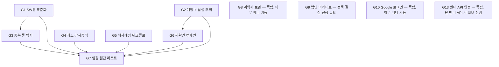
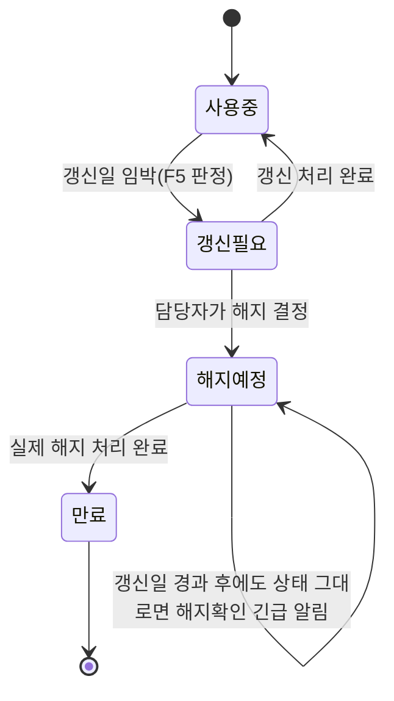
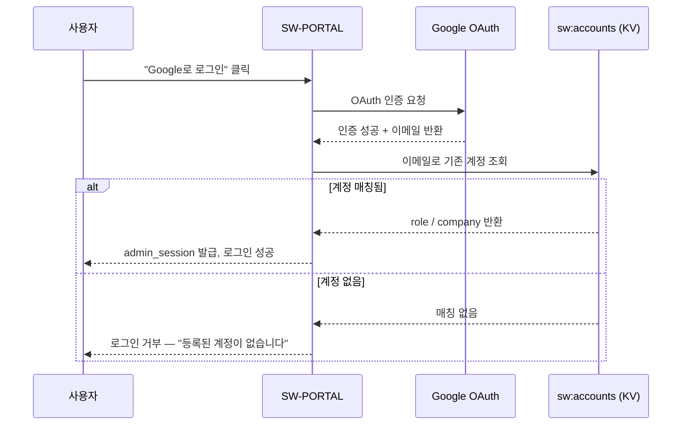

# 구독형 SaaS 라이선스 관리 — 2차 개발 기획서 (Claude Code 실행용, 맥 중앙 DB 환경)

> 1차 개발(F1~F7 + 거버넌스 스코어카드 + 벤더 통합 뷰)은 이미 `master`에 반영되어
> 있다. 이 문서는 **그 이후에 필요한 것들**을 정리한 2차 기획서다. 형식은 1차와
> 동일하게 "배경 → 요구사항 → 설계 → 수용기준 → Claude Code 프롬프트" 순으로
> 정리했고, 이번엔 **설계 내용을 반드시 포함**한다 — 개발자가 구조를 추측하지 않고
> 바로 구현에 들어갈 수 있게 하기 위함이다.
>
> 이 문서는 성격이 다른 내용을 구분해서 담았다: **흐름·상태·의존관계처럼 글로
> 읽으면 헷갈리는 부분은 다이어그램**으로, **필드/API처럼 찾아보는 용도의 정보는
> 표**로, **요구사항·수용기준·지시문처럼 정확히 지켜야 하는 부분은 글**로 썼다.

---

## 전체 그림 (진행 상황 한눈에 보기)

```mermaid
flowchart LR
    subgraph P1["1차 개발 — 완료, master 반영됨"]
        F1["F1 이상치 경고"]
        F3["F3 환율 이력화"]
        F4["F4 카드명세 업로드"]
        F5["F5 알림(화면표시)"]
        GOV["거버넌스 스코어카드+그룹핑"]
        VEN["벤더 통합 협상 뷰"]
    end
    subgraph P2["2차 개발 — 이 문서, 신규 착수 대상"]
        G1["G1 SW명 표준화"]
        G2["G2 계정 비활성 추적"]
        G3["G3 중복 툴 탐지"]
        G4["G4 최소 감사증적"]
        G5["G5 해지예정 워크플로"]
        G6["G6 재확인 캠페인"]
        G7["G7 임원 월간 리포트"]
        G8["G8 계약서 보관"]
        G9["G9 법인 아카이브 정책"]
        G10["G10 Google 로그인"]
        G13["G13 벤더 API 연동 로드맵"]
    end
    subgraph HOLD["보류 / 범위 제외 — 재검토 없이 착수 금지"]
        G11["G11 카드사 API 연동 — 외부 협의 필요"]
        G12["G12 전자결재 연동 — 설계서만 존재"]
        SSO["자체 OAuth SSO 구축 — 과도 판단, 범위 제외"]
        COLD["윈도우 콜드스페어 DB — 결정 철회(revert 완료)"]
    end
    P1 --> P2
    P2 -.보류 항목 참고.-> HOLD
```



이 문서(2차 개발)만 놓고 봤을 때 어떤 티켓이 어떤 티켓을 선행해야 하는지는
[1. 우선순위 요약](#1-우선순위-요약)의 의존성 다이어그램에서 다룬다.

---

## 0. 사용법

1. 새 Claude Code 세션(맥 장비)에서 **0-A 공통 컨텍스트 프롬프트**를 가장 먼저
   붙여넣는다(세션 최초 1회).
2. 티켓은 **우선순위 순서대로, 하나씩** 진행한다. 기능 1개 = 커밋 1개.
3. 모든 쓰기는 `lib/repo/mirror.ts`(`upsertEntity`/`deleteEntity`) 또는
   `lib/kv-store.ts`(`kvSetPermanent`)를 거친다 — Notion 직접 쓰기, Redis/Upstash
   재도입 금지 (`AGENTS.md` 참고).
4. 각 티켓 완료 후 무엇을 바꿨는지 요약 보고, `npx tsc --noEmit`으로 기존 베이스라인
   오류 외 신규 오류 없는지 확인.
5. 커밋/푸시/머지/프로덕션 배포는 **명시적 승인 후에만** 진행한다.
6. 필드/스키마 변경이나 API 목록이 헷갈리면 매번 각 티켓을 다시 읽지 말고
   **0-B 요약표**를 먼저 확인한다.

---

## 0-A. 공통 컨텍스트 프롬프트 (세션 시작 시 1회 필수)

```
너는 idsTrust 자산관리파트의 사내 포털(SW-PORTAL) 코드베이스에서 작업한다.
작업 전에 반드시 아래를 먼저 확인해라.

1. 이 저장소는 v4.0 아키텍처다 — 맥북(이 기기) 한 대가 중앙 DB. 자체 호스팅
   Supabase(Postgres)를 Tailscale Funnel로 노출한다. Notion은 5분 주기 단방향
   백업일 뿐, 앱은 Notion에 직접 쓰지 않는다. 상세: docs/ARCHITECTURE-4.0.md,
   AGENTS.md (필수 선독).
2. 데이터 접근 규칙:
   - 범용 엔티티(HW 제외 전부): lib/repo/mirror.ts 의 readEntity/readEntityOne/
     upsertEntity/deleteEntity. SW 라이선스는 entity="sw" (lib/sw-notion.ts의
     SW_ENTITY).
   - HW 전용: lib/repo/hw.ts.
   - 설정/캐시성 데이터(Notion 대응 DB가 없는 것): lib/kv-store.ts의 kvGet/
     kvSetPermanent/kvDel (Postgres public.kv 테이블).
   - 쓰기 함수는 전부 boolean을 반환한다 — 반드시 반환값을 확인하고, 실패 시
     "성공"으로 착각한 응답을 보내지 마라(이 프로젝트에 실제 중복발송 사고
     이력이 있다).
3. 이미 구현된 것(1차 개발, 재구현 금지 — 확장만 할 것):
   - types/index.ts의 SwDbRecord에 paymentDate 필드 있음(구독 결제일, 환율 환산 기준)
   - lib/exchange-rate.ts: 결제일 기준 USD→KRW 환율(Frankfurter API, Postgres KV 캐시)
   - lib/anomaly-detection.ts: 이상치 판정(담당자미지정/인당비용이상치/비용확인필요)
   - lib/subscription-alerts.ts: 갱신임박/예산초과/제출기한 알림 판정
   - lib/card-import.ts, lib/card-reconcile.ts: 카드명세 업로드·매핑·대사
   - lib/governance-groups.ts: 계열사 그룹 매핑
   - components/admin/{ReportPanel,CardImportPanel,SubscriptionAlerts,
     GovernanceScorecard,VendorConsolidationPanel}.tsx
   - app/api/{report,exchange-rate,card-import/*,subscription-alerts/*,
     governance-scorecard/*,vendor-consolidation}/route.ts
4. 새 UI/스타일 라이브러리를 임의로 도입하지 마라. 기존 컴포넌트의 다크 사이드바
   톤 + 앰버 강조색, Tailwind 유틸리티 클래스 패턴을 그대로 따른다.
5. 역할 모델: session.role은 "super"(전체 법인) | "company"(자기 법인만,
   companyScope()) | "general". 그룹 전체 데이터를 다루는 화면(거버넌스/카드명세/
   벤더통합)은 super 전용으로 만든다(resolveCurrentRole 서버 재검증 필수).
6. 각 기능은 작은 단위로 구현하고, 끝날 때마다 무엇을 바꿨는지 요약해서 알려줘라.
   여러 기능을 한 커밋에 섞지 마라.
```

---

## 0-B. 참조용 요약표 (스키마 변경 / 신규 API)

구현 중 "이 필드가 이미 있었나?", "새 라우트가 몇 개나 생기나?"를 매번 각 티켓
본문에서 찾지 않도록, 흩어져 있는 변경사항을 모아둔 표다. 실제 판단 기준과
로직은 각 티켓의 **설계** 항목이 원본이다 — 이 표는 색인일 뿐이다.

**SwDbRecord 필드 변경**

| 필드 | 상태 | 관련 티켓 | 용도 |
|---|---|---|---|
| `paymentDate` | 이미 있음(1차 F3) | - | 결제일 기준 환율 환산 |
| `lastModifiedBy` / `lastModifiedAt` | 있는지 확인 필요 | G4 | 최소 감사증적(있으면 재사용, 없으면 신규) |
| `lastConfirmedAt` | 신규 | G6 | 담당자의 "아직 씀" 수동 확인 시각 |
| `contractFile` | 신규 또는 `certificate` 재활용(확인 후 결정) | G8 | 계약서 원본 Blob URL |
| `status`에 `"해지예정"` 값 추가 | 신규 상태값(필드는 기존) | G5 | 해지예정 워크플로 |

**신규/확장 API 라우트**

| 라우트 | 메서드 | 인증 등급 | 관련 티켓 | 구분 |
|---|---|---|---|---|
| `/api/sw-alias` | GET/POST/DELETE | 슈퍼 전용 | G1 | 신규 |
| `/api/sw/confirm-usage` | POST | 로그인 필요 | G6 | 신규 |
| `/api/governance-scorecard/monthly-summary` | GET | 슈퍼 전용 | G7 | 신규 |
| `/api/vendor-usage/sync` | POST | 슈퍼 전용 | G13 | 신규(1단계는 수동 트리거만) |
| `/api/admin/auth` | POST | - | G2 | 기존 확장(`lastLoginAt` 기록) |
| `/api/governance-scorecard` | GET | 슈퍼 전용 | G2, G6, G9 | 기존 확장(신규 집계 필드 추가) |
| `/api/subscription-alerts` | GET | - | G5, G13 | 기존 확장(`cancellation` 알림 타입, `vendor-api` 소스) |
| `/api/sw/update`, `/api/sw/upload` | POST | - | G4, G8 | 기존 확장 |
| `/admin/login` (Google OAuth 콜백 포함) | GET/POST | - | G10 | 기존 확장 + OAuth 흐름 추가 |

---

## 1. 우선순위 요약

| 순서 | 티켓 | 의존성 | 비고 |
|---|---|---|---|
| 1 | G1. SW명 표준화/별칭 매핑 | 없음 | 이상치·벤더통합 정확도의 기반, 먼저 하는 게 이득 |
| 2 | G2. 계정 비활성/최종 활동일 추적 | 없음 | 거버넌스 스코어카드에 바로 반영 |
| 3 | G3. 중복 툴(카테고리 내 복수 SW) 탐지 | G1 권장 | Zylo 벤치마크에서 확인된 즉시 구현 가능 항목 |
| 4 | G4. 등록 확인 필드(최소 감사증적) | 없음 | 전자결재(F7) 전까지의 임시 통제장치 |
| 5 | G5. 해지예정 상태 워크플로 | 없음 | |
| 6 | G6. 미사용 의심 라이선스 재확인 캠페인 | G2 | |
| 7 | G7. 임원용 월간 리포트 | G1~G6 데이터 활용 | 정기 발행물, 마지막에 만드는 게 재료가 많음 |
| 8 | G8. 계약서 원본 보관 표준화 | 없음 | |
| 9 | G9. 법인 폐업/매각 데이터 정책 | 없음 | 정책 결정 후 코드 반영 |
| 10 | G10. "Google로 로그인" 추가(SSO 준비) | 없음 | 기존 ID/PW 병행, 인증서버 자체 구축 아님 |
| 11 | G13. SaaS 벤더 API 연동 로드맵(1단계: OpenAI/Anthropic) | 없음(단, 벤더 API 키 확보가 선행조건) | 실제 SW 현황 기반 벤더별 우선순위 정리 포함 |
| 보류 | G11. 카드사 API 자동 연동 | 외부(카드사) 협의 | 설계만 |
| 참고 | G12. 전자결재 연동 | 외부(사내 부서) 협의 | 이미 설계 문서 있음 — docs/ELECTRONIC-APPROVAL-INTEGRATION.md |

표의 "의존성" 칸만으로는 전체 그림(어디서 병목이 생기는지, G7이 왜 마지막인지)이
바로 안 보여서 아래에 의존관계를 다이어그램으로 다시 정리했다:



G7(임원 리포트)로 화살표가 모이는 이유는 단순하다 — G1~G6이 만들어내는 신호
(표준화된 SW명, 미확인 라이선스 수, 이상치·중복 탐지 결과)를 재료로 쓰기
때문이다. G8/G9/G10은 나머지와 데이터 의존이 없어 순서에 크게 구애받지 않고
아무 때나 끼워 넣을 수 있다.

---

## G1. SW명 표준화 / 별칭 매핑

**배경**: 벤더 통합 뷰(`/api/vendor-consolidation`)와 이상치 탐지는 `swCategory`
문자열을 그대로 그룹 키로 쓴다. "MS Office"와 "Microsoft 365"가 같은 SW인데 표기가
다르면 서로 다른 항목으로 잡혀 집계가 갈라진다. `lib/companies.ts`의
`normalizeCompany()`가 법인명에 대해 이미 하는 일을, SW명에 대해서도 해야 한다.

**설계**
- 신규 KV 키 `sw-alias:map` — `{ alias: string; canonical: string }[]` (Postgres KV,
  `lib/kv-store.ts` 재사용). Notion 백업 대상 아님(설정성 데이터).
- 신규 `lib/sw-alias.ts`:
  ```ts
  export async function normalizeSwName(raw: string): Promise<string>
  export async function getAliasMap(): Promise<{ alias: string; canonical: string }[]>
  export async function saveAliasMap(list: ...): Promise<boolean>
  ```
  `normalizeSwName`은 trim + 대소문자 무시 매칭으로 별칭 → 표준명을 반환, 매핑 없으면
  원본 그대로 반환(폴백).
- `app/api/vendor-consolidation/route.ts`와 `lib/anomaly-detection.ts` 호출부(즉
  `app/api/report/route.ts`, `app/api/governance-scorecard/route.ts`)에서 SW명을
  그룹 키로 쓰기 직전에 `normalizeSwName()`을 거치도록 수정.
- 관리 화면: `components/admin/SwDbPanel.tsx`(라이선스 설치 정책 관리) 하단 또는
  새 탭에 "SW명 별칭 관리" 표 추가 — 별칭 입력 → 표준명 선택(기존 canonical 값
  datalist로 자동완성), 목록/삭제.
- API: `app/api/sw-alias/route.ts` (GET/POST/DELETE, 슈퍼 전용).

**수용기준**
- [ ] "MS Office"를 별칭으로, "Microsoft 365"를 표준명으로 등록하면 벤더 통합 뷰에서
      하나로 합쳐져 보인다
- [ ] 별칭 미등록 SW는 기존과 동일하게(원본 표기 그대로) 동작한다
- [ ] 별칭 매핑 관리 화면에서 등록/삭제가 즉시 반영된다(캐시 없음 또는 즉시 무효화)

**Claude Code 프롬프트**
```
SW명 표준화(별칭 매핑) 기능을 추가해줘.

배경: 벤더 통합 뷰와 이상치 탐지가 SW대분류 문자열을 그대로 그룹 키로 쓰고 있어서,
표기가 다르면(예: "MS Office" vs "Microsoft 365") 같은 SW인데 따로 집계된다.

요구사항:
1. lib/sw-alias.ts 신규 생성. Postgres KV(lib/kv-store.ts의 kvGet/kvSetPermanent)에
   { alias, canonical } 배열을 저장한다. normalizeSwName(raw) 함수는 trim + 대소문자
   무시로 별칭을 찾아 표준명으로 바꾸고, 없으면 원본을 그대로 반환한다.
2. app/api/sw-alias/route.ts — GET(목록)/POST(추가·수정)/DELETE(삭제), 슈퍼어드민
   전용(resolveCurrentRole로 서버 검증).
3. app/api/vendor-consolidation/route.ts, app/api/report/route.ts,
   app/api/governance-scorecard/route.ts 에서 SW명을 그룹 키로 쓰기 직전에
   normalizeSwName()을 거치도록 수정. lib/anomaly-detection.ts 자체는 건드리지 말고
   호출부에서 이미 정규화된 이름을 넘겨라.
4. components/admin/SwDbPanel.tsx에 "SW명 별칭 관리" 섹션(또는 탭) 추가 — 별칭 입력
   필드 + 표준명 입력(기존 canonical 값 datalist 자동완성) + 목록/삭제. 기존 화면
   스타일(다크 사이드바 톤, 앰버 강조) 그대로 따라라.
5. 먼저 lib/companies.ts의 normalizeCompany() 패턴을 참고해서 일관된 코드 스타일로
   작성해라.
```

---

## G2. 계정 비활성 / 최종 활동일 추적

**배경**: 담당자가 퇴사하거나 업무가 바뀌어도 계정과 법인 배정이 그대로 남아있으면,
그 법인 데이터를 아무도 안 보는 상태가 될 수 있다. 지금은 이걸 감지할 방법이 없다.

**설계**
- `lib/session.ts`의 `AdminSession`은 그대로 두고, 로그인 성공 시점마다
  `app/api/admin/auth/route.ts`의 POST 핸들러에서 `sw:accounts`(KV) 레코드에
  `lastLoginAt: string(ISO)` 필드를 갱신한다(계정 배열 전체를 다시
  `kvSetPermanent`) — 기존 계정 관리 저장 패턴(`app/api/admin/accounts/route.ts`)과
  동일한 방식.
- `AccountsPanel.tsx` 목록에 "최종 로그인" 컬럼 추가, 90일 이상 미접속이면 배지 강조.
- `app/api/governance-scorecard/route.ts`에 각 법인의 담당자 계정 중 "90일 이상
  미접속"이 있으면 `CompanyScoreRow`에 `staleAdminCount` 필드 추가하고, 심각도
  판정(yellow)에 포함.

**수용기준**
- [ ] 로그인할 때마다 `lastLoginAt`이 갱신된다
- [ ] 계정 관리 화면에서 90일 이상 미접속 계정이 시각적으로 구분된다
- [ ] 거버넌스 스코어카드에서 해당 법인이 "확인 필요"로 표시된다

**Claude Code 프롬프트**
```
계정 최종 로그인일 추적 기능을 추가해줘.

요구사항:
1. app/api/admin/auth/route.ts의 로그인 성공 처리 부분에서, sw:accounts(KV) 배열의
   해당 계정에 lastLoginAt: 현재시각(ISO) 을 기록하고 kvSetPermanent로 저장해라.
   저장 실패해도 로그인 자체는 막지 말고(로그인 경험을 해치면 안 됨), console.warn만
   남겨라.
2. components/admin/AccountsPanel.tsx 목록에 "최종 로그인" 컬럼을 추가하고, 90일
   이상 지났거나 한 번도 로그인 안 한 계정은 주황/빨강 계열로 강조 표시해라.
3. app/api/governance-scorecard/route.ts에서 각 법인에 배정된 company-scope 계정들
   중 90일 이상 미접속인 게 있으면 CompanyScoreRow에 staleAdminCount 필드를 추가하고,
   1건 이상이면 심각도를 최소 yellow로 올려라(다른 조건과 병합, 기존 severity 계산
   로직 참고).
4. components/admin/GovernanceScorecard.tsx 테이블에 이 정보를 컬럼 또는 배지로
   노출해라.
5. 먼저 app/api/admin/accounts/route.ts를 읽고 기존 계정 저장 패턴을 그대로 따라라.
```

---

## G3. 중복 툴 탐지

**배경**: 지난 Zylo 벤치마크에서 확인한 항목 — 같은 카테고리(예: "협업")에 여러 SW가
동시에 활성 상태로 결제되고 있으면, 실제로는 하나로 통합 가능한 중복 지출일 수 있다.
이미 있는 카테고리 분류기(`lib/reportTypes.ts`의 `mapCategory()`)로 바로 만들 수 있다.

**설계**
- 신규 `lib/duplicate-tool-detection.ts`:
  ```ts
  export interface DuplicateToolGroup {
    company: string; department: string; category: string;
    swNames: string[]; totalMonthlyKrw: number;
  }
  export function detectDuplicateTools(rows: {
    company: string; department: string; category: string; swName: string; monthlyKrw: number;
  }[]): DuplicateToolGroup[]
  ```
  로직: `company+department+category`로 그룹핑 → `swNames`(Set) 크기가 2 이상이면
  후보로 반환.
- `app/api/report/route.ts`가 만드는 `rows`(이미 `category` 필드 있음)를 그대로
  입력으로 써서 `ReportPanel.tsx`에 새 섹션("중복 가능성 있는 SW") 추가 — F1
  이상치 배너와 같은 위치, 비슷한 UI 패턴(클릭 시 해당 부서로 스크롤).
- G1(SW명 표준화)이 먼저 되어 있으면 정확도가 올라간다(같은 SW의 표기 차이가
  "다른 SW"로 오인되는 걸 막아줌) — 순서상 G1 다음에 하는 걸 권장.

**수용기준**
- [ ] 한 부서가 "협업" 카테고리에 Slack과 Teams를 동시 결제 중이면 배너에 뜬다
- [ ] 클릭 시 해당 부서 상세로 스크롤된다(F1 이상치 배너와 동일 동작)
- [ ] 카테고리가 1개 SW만 있는 경우는 뜨지 않는다

**Claude Code 프롬프트**
```
"구독형 라이선스 현황" 화면에 중복 툴 탐지 기능을 추가해줘.

배경: 같은 카테고리(예: "협업")에 여러 SW를 동시에 결제 중이면 통합 가능한 중복
지출일 수 있다. lib/reportTypes.ts의 mapCategory()가 이미 SW를 카테고리로 분류하고
있으니 그걸 재사용한다.

요구사항:
1. lib/duplicate-tool-detection.ts 신규 생성. 법인+부서+카테고리로 그룹핑해서, 같은
   그룹에 서로 다른 SW명이 2개 이상이면 "중복 후보"로 반환하는 순수 함수를 만들어라
   (부작용 없는 함수로, 이미 있는 lib/anomaly-detection.ts의 annotateAnomalies와
   비슷한 스타일).
2. components/admin/ReportPanel.tsx에서 이 함수를 이미 계산된 rows(SubRow[], category
   필드 있음)에 적용해서, F1 이상치 배너(AnomalyBanner)와 같은 자리에 "중복 가능성
   있는 SW" 배너를 추가해라. 클릭하면 해당 부서로 스크롤+하이라이트되는 기존
   scrollToDept() 함수를 재사용해라.
3. 기존 이상치 배너 스타일(빨강/주황 톤)과 구분되게 다른 색(예: 파랑/보라 계열)을
   써서 두 종류 경고가 헷갈리지 않게 해라.
4. 먼저 components/admin/ReportPanel.tsx의 AnomalyBanner, getAnomalyFlags 사용 부분을
   읽고 동일한 패턴으로 구현해라.
```

---

## G4. 등록 확인 필드 (최소 감사증적)

**배경**: 전자결재 연동(F7/G12)이 되기 전까지, 지금은 "누가 이 지출을 승인했는지"를
아무도 확인할 방법이 없다. 완전한 결재 시스템을 만들 필요는 없고, 최소한의 흔적만
남기면 된다.

**설계**
- `SwDbRecord`에 필드 추가: `confirmedBy?: string`(확인자 이름+ID),
  `confirmedAt?: string`(ISO). `types/index.ts`에 optional로 추가(G4는 F3의
  `paymentDate` 추가와 동일한 패턴).
- `LicensePanel.tsx`의 `SwEditModal`/`SwManualAdd`에 "등록/변경 확인자" 필드는
  **입력받지 않는다** — 대신 저장 시점에 서버(`app/api/sw/update`,
  `app/api/sw/upload`)에서 **현재 로그인한 세션의 이름+ID를 자동으로 기록**한다
  (신뢰할 수 없는 클라이언트 입력에 의존하지 않기 위함). 기존
  `lastModifiedBy`/`lastModifiedAt` 필드가 사실상 이미 이 역할을 하고 있는지
  먼저 확인하고, 이미 충분하면 새 필드를 만들지 말고 그대로 노출만 하면 된다.
- 노출: `LicensePanel.tsx` 상세보기(`SwDetailModal`)에 "최종 확인자/일시" 표시(이미
  있으면 그대로 활용).

**수용기준**
- [ ] 라이선스 등록/수정 시 누가 언제 했는지가 레코드에 남는다(신규 필드든 기존
      lastModifiedBy 활용이든 상관없음)
- [ ] 상세보기에서 이 정보가 보인다
- [ ] 클라이언트가 임의로 확인자 이름을 조작해서 보낼 수 없다(서버에서 세션 기준으로
      덮어씀)

**Claude Code 프롬프트**
```
SW 라이선스 등록/수정 시 "누가 확인했는지" 최소한의 감사증적을 남기는 기능을
점검·보완해줘.

먼저 확인할 것: types/index.ts의 SwDbRecord에 lastModifiedBy/lastModifiedAt 필드가
이미 있고, app/api/sw/update/route.ts와 app/api/sw/upload/route.ts가 저장 시점에
이걸 서버에서 세션 기준으로 채우고 있는지 확인해라.

- 이미 그렇게 되어 있으면: components/admin/LicensePanel.tsx의 SwDetailModal(상세
  보기)에 이 정보가 명확히 보이는지만 확인하고, 안 보이면 추가해라. 새 필드는
  만들지 마라.
- 안 되어 있으면(예: 클라이언트가 보낸 값을 그대로 믿고 저장하는 구조라면): 서버
  라우트에서 클라이언트가 보낸 확인자 필드는 무시하고, 항상 현재 세션(getSession
  ecookieHeader → resolveCurrentName)의 이름+ID로 덮어써서 저장하도록 고쳐라.

주의: 이건 완전한 결재 시스템이 아니다. "누가 마지막으로 손댔는지"만 신뢰성 있게
남기면 되는 최소 기능이다. 승인 워크플로(상신→승인)는 별도 티켓(G12, 전자결재
연동)에서 다룬다 — 여기서는 만들지 마라.
```

---

## G5. 해지예정 상태 워크플로

**배경**: 갱신 임박 알림(F5)은 있지만, "이번엔 갱신하지 않고 해지하기로 결정"했을 때
그 결정을 추적할 방법이 없다. 결정은 됐는데 실제 해지 처리가 안 된 채로 계속
결제되는 케이스를 놓치기 쉽다.

**설계**
- `SwDbRecord.status`에 이미 있는 값 목록(`SW_STATUS_OPTIONS` in
  `components/admin/LicensePanel.tsx`: "사용중","재고","갱신필요","만료","신규등록",
  "반납예정","출고준비중","임시지급","미확인")에 **"해지예정"** 을 추가한다 — 새
  필드를 만들지 않고 기존 상태값 체계를 확장하는 것으로 충분하다.
- `app/api/subscription-alerts/route.ts`(F5)의 갱신 임박 판정에서, `status ===
  "해지예정"`인 항목은 "갱신 필요" 알림에서 제외하고 대신 "해지 처리 확인 필요"
  알림(신규 타입 `"cancellation"`)으로 바꿔서 보여준다 — 갱신일이 지났는데도
  `status`가 여전히 "해지예정"이면 "실제 해지가 됐는지 확인" 알림을 urgent로 띄운다.
- `lib/subscription-alerts.ts`의 `AlertType`에 `"cancellation"` 추가,
  `buildAlerts()`에 판정 로직 추가.

글로 풀면 조건문이 여러 겹이라 헷갈리기 쉬워서, 상태 전이로 다시 그리면:



핵심은 "해지예정" 상태가 갱신일을 지나서도 그대로 남아있는 한 칸 —
그 시점부터는 갱신임박 알림이 아니라 "해지 처리 확인 필요" 긴급 알림으로
바뀌어야 한다는 것이다.

**수용기준**
- [ ] 상태를 "해지예정"으로 바꾸면 그 항목은 더 이상 갱신임박 알림에 안 뜬다
- [ ] 갱신일이 지났는데 상태가 여전히 "해지예정"이면 별도 긴급 알림이 뜬다
- [ ] 실제로 상태를 "만료"나 삭제로 바꾸면 이 알림이 사라진다

**Claude Code 프롬프트**
```
구독 SW "해지예정" 상태와 그에 대한 후속 확인 알림을 추가해줘.

요구사항:
1. components/admin/LicensePanel.tsx의 SW_STATUS_OPTIONS 배열에 "해지예정"을
   추가해라(기존 배열에 항목 하나 추가하는 정도로 충분, 새 필드 만들지 마라).
2. lib/subscription-alerts.ts의 AlertType에 "cancellation"을 추가하고, buildAlerts()
   에 로직을 추가해라: status가 "해지예정"인 항목은 기존 갱신임박(renewal) 판정에서
   제외하고, 그 대신 갱신일이 지났는데도 아직 "해지예정" 상태로 남아있으면
   "해지 처리 확인 필요" 알림(urgent)을 만들어라. 갱신일이 아직 안 지났으면 알림을
   만들지 마라(아직 해지 처리 기간이 남아있으므로).
3. app/api/subscription-alerts/route.ts에서 이 판정에 필요한 status 필드를
   RenewalTarget 또는 별도 타입에 포함시켜 전달해라.
4. components/admin/SubscriptionAlerts.tsx의 TYPE_LABEL에 "cancellation": "해지 확인"
   같은 라벨을 추가해서 화면에 구분되어 보이게 해라.
5. 먼저 lib/subscription-alerts.ts 전체를 읽고 기존 renewal/budget/submission 판정과
   동일한 코드 스타일로 작성해라.
```

---

## G6. 미사용 의심 라이선스 재확인 캠페인

**배경**: "사용자 필드가 비어있다"(F1)까지는 감지할 수 있지만, 사용자 필드는 채워져
있는데 실제로는 안 쓰는 경우(SSO 로그 없이는 알 수 없음)까지는 못 잡는다. 대신
담당자에게 주기적으로 "아직 쓰시나요?"라고 물어보는 사람 개입형 프로세스로 대체한다.

**설계**
- 신규 엔티티 방식 대신, 기존 SW 레코드에 필드 추가: `lastConfirmedAt?: string`
  (담당자가 마지막으로 "아직 씀"이라고 확인한 시각). `types/index.ts`에 optional
  추가.
- 신규 API `app/api/sw/confirm-usage/route.ts` — POST `{id}`, 세션 확인 후
  `applyFields`로 `lastConfirmedAt`을 현재시각으로 갱신(로그인한 아무 사용자나 —
  본인이 그 라이선스 사용자인지는 검증하지 않아도 됨, 담당자가 대리 확인 가능).
- "캠페인" 자체는 별도 발송 기능을 만들지 않는다(F5 설계 때 정한 "화면 표시만"
  원칙 유지) — 대신:
  - `ReportPanel.tsx`에 "6개월 이상 미확인" 필터/배지 추가.
  - 라이선스 상세/수정 화면에 "사용 확인" 버튼 하나 추가 — 눌러서 담당자가 직접
    "아직 씁니다"를 표시.
  - 거버넌스 스코어카드에 법인별 "미확인 라이선스 수"를 새 컬럼으로 추가.

**수용기준**
- [ ] "사용 확인" 버튼을 누르면 `lastConfirmedAt`이 갱신된다
- [ ] 6개월 이상 미확인 항목이 목록에서 구분되어 보인다
- [ ] 거버넌스 스코어카드에서 법인별 미확인 건수를 볼 수 있다

**Claude Code 프롬프트**
```
미사용 의심 라이선스 재확인 기능을 추가해줘(발송 기능 없이 화면 표시·수동 확인만).

배경: 실제 로그인 여부는 SSO 연동 없이 알 수 없으니, 담당자가 "아직 씁니다"를
주기적으로 직접 확인하게 하는 방식으로 간다. F5 때 정한 원칙(자동 메일 발송 안 함)을
그대로 유지해라.

요구사항:
1. types/index.ts의 SwDbRecord에 lastConfirmedAt?: string 필드를 추가해라(paymentDate
   추가했던 방식과 동일하게 optional).
2. app/api/sw/confirm-usage/route.ts 신규 생성 — POST { id }, 세션 확인 후
   lib/sw-notion.ts의 applyFields 또는 직접 upsertEntity로 lastConfirmedAt을 현재
   시각(ISO)으로 갱신해라.
3. components/admin/LicensePanel.tsx의 상세보기(SwDetailModal)에 "사용 확인" 버튼을
   추가해서 위 API를 호출하게 해라. 목록에서 lastConfirmedAt이 6개월(180일) 이상
   지났거나 없으면 배지로 표시해라(주황 계열, 기존 이상치 배지 스타일 참고).
4. app/api/governance-scorecard/route.ts에 법인별 "6개월 이상 미확인 라이선스 수"를
   집계해서 CompanyScoreRow에 unconfirmedCount 필드로 추가하고,
   components/admin/GovernanceScorecard.tsx 테이블에 컬럼으로 노출해라.
5. 발송 기능은 만들지 마라 — 화면 표시와 담당자의 수동 클릭 확인까지만.
```

---

## G7. 임원용 월간 리포트

**배경**: 임원은 로그인해서 화면을 매번 확인하기보다, 정기적으로 요약된 보고서를
받아보길 원한다. G1~G6이 쌓일수록 이 리포트에 넣을 재료(이상치·중복탐지·미확인·
벤더통합 후보)가 많아지므로 순서상 뒤에 배치했다.

**설계**
- 신규 API `app/api/governance-scorecard/monthly-summary/route.ts` (GET, 슈퍼 전용):
  - 이번 달 vs 지난달 전사 구독 지출 합계 비교(증감률)
  - 법인별 상위 지출 증가 TOP 5
  - 벤더 통합 후보 상위 5건(`/api/vendor-consolidation` 로직 재사용)
  - 이상치/중복탐지/미확인 라이선스 총 건수
  - `lib/metrics-snapshot.ts`(이미 있는 "전월 대비 스냅샷" 인프라, `getMonthOverMonthTrend`
    함수)를 재사용할 수 있는지 먼저 확인 — 있으면 새로 안 만들고 그걸 확장.
- 화면: 새 관리자 패널 `components/admin/ExecutiveSummaryPanel.tsx` — 프린트 친화적
  레이아웃(기존 `ReportPanel.tsx`의 `printNow()`/인쇄 전용 뷰 패턴 재사용 —
  PDF로 저장해 임원에게 공유하는 용도).
- **메일 자동 발송은 만들지 않는다**(F5/G6과 동일 원칙 — 중복발송 사고 이력).
  담당자가 화면에서 인쇄/PDF 저장해 수동으로 공유하는 것까지만.

화면 구성은 말로 설명하는 것보다 레이아웃을 직접 보여주는 게 빠르다 — 아래
배치를 그대로 구현 기준으로 삼는다(수치·디자인 토큰은 기존 컴포넌트 스타일을
따르고, 이건 배치·정보 우선순위만 나타낸 스케치다):

```
┌───────────────────────────────────────────────────────┐
│  임원용 월간 SaaS 지출 요약                 [인쇄/PDF]  │
├───────────────────────────────────────────────────────┤
│   이번 달 전사 지출          지난달 대비 증감률          │
│   ₩ xxx,xxx,xxx              ▲ xx.x%                    │
├───────────────────────────────────────────────────────┤
│   법인별 지출 증가 TOP 5                                 │
│   1. OO법인   ₩xx,xxx,xxx   (전월比 +xx%)                │
│   2. ...                                                 │
├───────────────────────────────────────────────────────┤
│   벤더 통합 협상 후보 TOP 5                               │
│   1. Slack — 3개 법인이 각자 계약 중                      │
│   2. ...                                                 │
├───────────────────────────────────────────────────────┤
│   이상치 xx건 · 중복탐지 xx건 · 미확인 라이선스 xx건       │
└───────────────────────────────────────────────────────┘
```

위→아래 순서 자체가 우선순위다: "총액/추세"(가장 급한 판단 재료) →
"어디서 늘었나" → "무엇을 통합할 수 있나" → "세부 확인 필요 건수". 임원이
스크롤 없이 첫 화면만 봐도 결론이 나오게 하는 게 목적이다.

**수용기준**
- [ ] 이번 달/지난달 전사 지출과 증감률이 한 화면에 보인다
- [ ] 법인별 지출 증가 TOP 5가 보인다
- [ ] 인쇄 버튼으로 PDF 저장이 가능하다(기존 ReportPanel 인쇄 로직 재사용)

**Claude Code 프롬프트**
```
임원용 월간 SaaS 지출 요약 리포트 화면을 추가해줘.

먼저 확인: lib/metrics-snapshot.ts에 이미 전월 대비 스냅샷/추세 계산 인프라
(getMonthOverMonthTrend 등)가 있는지 읽어보고, 있으면 새로 만들지 말고 확장해서 써라.

요구사항:
1. app/api/governance-scorecard/monthly-summary/route.ts 신규 생성(슈퍼어드민 전용,
   resolveCurrentRole로 검증) — 이번 달 vs 지난달 전사 구독 지출 합계와 증감률,
   법인별 지출 증가 TOP 5, 벤더 통합 후보 상위 5건(app/api/vendor-consolidation의
   로직을 함수로 뽑아 재사용), 이상치/미확인 라이선스 총 건수를 반환해라.
2. components/admin/ExecutiveSummaryPanel.tsx 신규 생성 — 위 데이터를 보여주는
   화면. components/admin/ReportPanel.tsx의 printNow() 함수와 "인쇄 전용 뷰"
   패턴(report-print-only 클래스, @page 설정)을 그대로 재사용해서 인쇄/PDF 저장이
   되게 해라.
3. 메일 자동 발송 기능은 만들지 마라 — 화면 표시 + 인쇄(PDF 저장)까지만.
4. app/admin/page.tsx에 슈퍼 전용 메뉴로 추가해라("계열사 거버넌스" 옆 또는
   비슷한 위치).
```

---

## G8. 계약서 원본 보관 표준화

**배경**: `draftDocument`(기안문서)는 있는데, 실제 계약서/약관 PDF를 보관하는
표준 위치가 없다. 나중에 법무 검토·분쟁 시 "계약서 원본이 어디 있는지"를 못 찾을
수 있다.

**설계**
- 새 필드 만들지 않고 **기존 `certificate`(증서) 필드의 용도를 계약서까지
  포함하도록 명확히 하거나**, 별도로 `SwDbRecord.contractFile?: string`(Blob URL)
  추가 — 어느 쪽이 나을지는 기존 `certificate` 필드가 실제로 뭘 담고 있는지
  (증서 전용인지, 계약서도 섞여 있는지) 먼저 확인하고 결정한다.
- 업로드는 `lib/blob-store.ts`(Vercel Blob, 이미 사용 중) 재사용 —
  `LicensePanel.tsx`의 `SwEditModal`이 이미 증서 파일 업로드(`uploadFile` 함수,
  `/api/sw/cert-upload`)를 갖고 있으므로 동일 패턴으로 계약서 업로드 필드만
  추가한다.

**수용기준**
- [ ] 라이선스 레코드에 계약서 PDF를 업로드하면 Blob에 저장되고 URL이 기록된다
- [ ] 상세보기에서 계약서 파일 링크를 열어볼 수 있다
- [ ] 기존 증서 업로드 기능과 충돌하지 않는다

**Claude Code 프롬프트**
```
SW 라이선스 레코드에 계약서 원본 첨부 기능을 추가해줘.

먼저 확인: types/index.ts의 certificate 필드가 지금 실제로 무슨 용도로 쓰이고
있는지(증서 전용인지, 계약서 첨부도 이 필드로 되고 있는지) LicensePanel.tsx와
app/api/sw/cert-upload/route.ts를 읽고 판단해라.

- 이미 계약서 첨부 용도로 쓰이고 있으면: 새 필드 만들지 말고, 상세보기에서 라벨을
  "증서/계약서"로 명확히 하는 정도만 해라.
- 별도 용도로 안 쓰이고 있으면: types/index.ts의 SwDbRecord에 contractFile?: string
  필드를 추가하고, LicensePanel.tsx의 SwEditModal에 기존 증서 업로드(uploadFile
  함수, /api/sw/cert-upload)와 동일한 패턴으로 계약서 업로드 필드를 하나 더 추가해라.
  app/api/sw/update/route.ts, lib/sw-notion.ts의 applyFields도 이 필드를 처리하도록
  맞춰라.
- 어느 경우든 lib/blob-store.ts(Vercel Blob)를 그대로 재사용하고 새 저장소를
  도입하지 마라.
```

---

## G9. 법인 폐업/매각 데이터 정책

**배경**: 17개+ 계열사가 고정이 아닐 수 있다(매각·청산·신설). 법인이 없어졌을 때
그 데이터를 삭제/보관/이관하는 정책이 없다. 이건 **코드보다 정책 결정이 먼저다.**

**설계 (정책 결정 후 적용할 최소 코드 변경)**
- `lib/companies.ts`의 `COMPANIES` 배열에서 법인을 바로 지우지 말고, 별도
  `ARCHIVED_COMPANIES: string[]`를 만들어 "더 이상 신규 등록은 안 되지만 과거
  데이터 조회는 되는" 상태로 둔다(완전 삭제가 아닌 아카이브).
- 관련 화면(법인 선택 드롭다운 등)에서 `ARCHIVED_COMPANIES`는 필터/선택 목록에서
  제외하되, 이미 등록된 레코드는 그대로 조회 가능하게 유지.
- **선행 조건**: 아래 정책을 먼저 결정해야 한다(개발 착수 전 대표님 확인 필요) —
  1. 매각된 법인의 과거 데이터를 얼마나 보관할지(예: 3년)
  2. 보관 기간 후 삭제할지, 계속 조회만 막을지
  3. 매각 시 인수 법인에 데이터를 이관해야 하는 법적 의무가 있는지

**수용기준**
- [ ] (정책 결정 후) 아카이브된 법인은 신규 등록 드롭다운에 안 뜬다
- [ ] 과거에 등록된 그 법인 데이터는 조회·리포트에서 계속 보인다
- [ ] 거버넌스 스코어카드에서 아카이브 법인은 기본적으로 숨겨진다(옵션으로 보기 가능)

**Claude Code 프롬프트 (정책 결정 후에 실행)**
```
[사전 조건: 아래 정책이 결정된 뒤에 이 프롬프트를 실행할 것]
- 보관 기간: ___
- 보관 기간 후 처리: 삭제 / 조회만 차단 (택1)

법인 아카이브 기능을 추가해줘.

요구사항:
1. lib/companies.ts에 ARCHIVED_COMPANIES: string[] 배열을 추가해라(빈 배열로 시작).
2. 법인 선택 드롭다운이 있는 화면(LicensePanel, ReportPanel, 계정관리 등 —
   COMPANIES를 import하는 곳 전부 grep해서 확인)에서 신규 등록/필터 용도로는
   ARCHIVED_COMPANIES에 있는 법인을 제외하되, 이미 그 법인으로 등록된 기존 레코드는
   여전히 조회되게 해라(COMPANIES 배열 자체에서 지우지 마라 — 과거 데이터의 company
   필드 값이 무효가 되면 안 된다).
3. app/api/governance-scorecard/route.ts에서 기본적으로 ARCHIVED_COMPANIES는
   집계에서 제외하되, 쿼리 파라미터(예: ?includeArchived=1)로 볼 수 있게 해라.
4. 이 기능은 법인을 "삭제"하는 게 아니라 "숨기고 보존"하는 것임을 명심해라 — 관련
   레코드를 지우거나 status를 임의로 바꾸지 마라.
```

---

## G10. "Google로 로그인" 추가 (SSO 준비, 자체 인증서버 아님)

**배경**: 임원/대표님이 향후 GWS(Google Workspace) 도입을 염두에 두고 있으나
시점 미정. 자체 OAuth 2.0 인가서버를 만드는 건 보안 유지부담이 크고 과함 — 대신
"Google로 로그인"(OAuth 클라이언트)만 기존 ID/PW 로그인과 병행 추가한다. GWS 도입
여부와 무관하게 지금 바로 동작하고, 나중에 GWS가 도입되면 `hd=` 파라미터 하나만
추가해서 그 도메인 계정으로 제한하면 된다.

**설계**
- 라이브러리: `next-auth`(Auth.js) 또는 직접 OAuth 플로우 구현 중 택1 — 기존
  `lib/session.ts`의 자체 서명 세션 쿠키 방식과 최대한 맞물리게, **Auth.js를
  도입하되 로그인 성공 후 기존 `admin_session` 쿠키를 그대로 발급**하는 방식을
  권장(미들웨어/기존 role 체계를 안 건드리기 위함).
- Google 로그인 성공 시: 이메일로 `sw:accounts`(KV)에서 기존 계정을 찾는다.
  - 매칭되면: 기존 계정의 role/company로 `admin_session` 발급.
  - 매칭 안 되면: 로그인 거부("등록된 계정이 없습니다. 관리자에게 문의하세요") —
    Google 로그인으로 **새 계정이 자동 생성되면 안 된다**(권한 없는 사람이
    가입해버리는 사고 방지).
- `app/admin/login/page.tsx`에 "Google로 로그인" 버튼 추가(기존 ID/PW 폼은 유지).
- 환경변수: `GOOGLE_CLIENT_ID`, `GOOGLE_CLIENT_SECRET`(Google Cloud Console에서
  발급, OAuth 동의 화면 설정 필요 — 이건 사람이 콘솔에서 직접 해야 함).

가장 중요한 건 "매칭 안 되면 거부"라는 분기 하나다 — 인증 흐름 자체를
시퀀스로 보면 이 분기가 어디서 일어나는지 명확해진다:



새 계정을 자동 생성하는 경로는 이 다이어그램에 아예 없다 — 그게 의도된
설계다. 계정 생성은 여전히 관리자 화면에서 사람이 직접 해야 한다.

**수용기준**
- [ ] "Google로 로그인" 클릭 → 구글 인증 → 기존에 등록된 계정 이메일과 일치하면
      로그인된다
- [ ] 등록 안 된 이메일로 로그인 시도하면 명확한 에러와 함께 거부된다
- [ ] 기존 ID/PW 로그인은 그대로 동작한다(택일이 아니라 병행)
- [ ] 세션/권한 체계(super/company/general, companyScope)는 기존과 동일하게 동작한다

**Claude Code 프롬프트**
```
관리자 로그인에 "Google로 로그인"을 기존 ID/PW 로그인과 병행 추가해줘. 자체 OAuth
인가서버를 만드는 게 아니라, 이 앱이 Google의 OAuth 클라이언트가 되는 것뿐이다.

요구사항:
1. next-auth(Auth.js)의 Google Provider를 쓰거나, 필요하면 직접 OAuth 코드 교환
   플로우를 구현해라 — 어느 쪽이든 로그인 성공 후에는 기존 lib/session.ts의
   encodeSession()으로 admin_session 쿠키를 발급하는 방식으로 맞춰서, 기존
   미들웨어(middleware.ts)와 역할 체계(session.role, companyScope)를 그대로 재사용해라.
2. Google 로그인이 성공하면, 받은 이메일로 sw:accounts(KV) 배열에서 기존 계정을
   찾아라(lib/session.ts, app/api/admin/accounts/route.ts 참고). 매칭되는 계정이
   있으면 그 계정의 role/company로 세션을 발급하고, 없으면 로그인을 거부해라
   ("등록된 계정이 없습니다. 관리자에게 문의하세요") — Google 로그인으로 새 계정이
   자동 생성되게 하지 마라.
3. app/admin/login/page.tsx에 "Google로 로그인" 버튼을 추가해라(기존 ID/PW 폼은
   그대로 유지, 대체가 아니라 병행).
4. 필요한 환경변수(GOOGLE_CLIENT_ID, GOOGLE_CLIENT_SECRET, NEXTAUTH_SECRET 등)를
   .env.example에 추가하고, docs/ARCHITECTURE-4.0.md의 환경변수 표에도 추가해라.
   실제 값은 절대 코드/문서에 남기지 마라.
5. 이 기능은 미래에 Google Workspace(GWS)가 도입돼도 코드 변경 없이 계속 동작해야
   한다 — GWS 계정도 결국 구글 계정이기 때문이다. 지금은 hd(호스팅 도메인) 제한을
   걸지 마라(아직 회사 도메인이 GWS로 확정 안 됐으므로).
```

---

## G11. 카드사 API 자동 연동 (보류 — 설계만)

카드사가 API/SFTP를 제공하는지 확인되지 않았다. 지금은 F4(수동 엑셀 업로드)로
충분하며, 카드사 협의가 된 뒤에 자동 수집으로 전환한다. 설계는 F7(G12)과 유사한
형태(웹훅 또는 폴링)가 될 것으로 예상되나, 실제 카드사 API 스펙을 받은 뒤 상세
설계를 다시 작성한다.

## G12. 전자결재 연동 (참고)

이미 설계 문서가 있다 — **[docs/ELECTRONIC-APPROVAL-INTEGRATION.md](ELECTRONIC-APPROVAL-INTEGRATION.md)**.
착수 전 그 문서의 §5(담당 부서 확인 필요 항목)를 먼저 해소해야 한다.

---

## G13. SaaS 벤더 사용량/청구 API 연동 로드맵

**배경**: 1차 개발 때 대표님 요청 — "종량제로 사용하는 라이선스는 GPT처럼 API
연동해서 데이터를 가져오는 구조로 가자". 이걸 위해 `lib/subscription-alerts.ts`의
`DeptSpend.source: "registered" | "vendor-api"`를 미리 확장 가능하게 설계해뒀지만,
실제 벤더 연동은 아직 하나도 구현되지 않았다. 지금 SW 현황에 등록된 SW들이 실제로
무엇인지는 `lib/reportTypes.ts`의 `CATEGORY_RULES`(카테고리 분류용 정규식)가
사실상 축소판 목록이다 — 이 문서는 그 목록을 기준으로 "어떤 벤더부터 API 연동이
현실적인지"를 미리 정리해, 개발자가 매번 벤더 문서를 처음부터 찾아보지 않게
한다.

> **주의**: 아래 벤더별 API 정보는 이 문서 작성 시점(2026년 초) 기준 알려진
> 내용이다. 벤더 API는 자주 바뀌고 등급(Enterprise/Business/Team)별로 제공 범위가
> 다르므로, 실제 착수 전 반드시 최신 문서와 현재 가입된 플랜을 다시 확인해야
> 한다 — 오래된 정보로 설계하면 헛수고가 된다.

**중요한 구분 — 이 요청은 사실 두 가지가 섞여 있다**

- **① 종량제 비용 추적형**: 실제 사용한 만큼 청구되는 서비스(OpenAI, Anthropic,
  AWS/Azure/GCP 등)는 API로 실제 청구액을 가져와 예산 상한(F5) 대비 실시간
  추적하는 게 목적 — 원래 요청("GPT처럼")이 가리키는 게 이쪽이다.
- **② 좌석 사용률 대사형**: Microsoft 365, Slack, Zoom, Adobe처럼 좌석(seat)
  단위로 정액 결제되는 서비스는 청구액이 이미 계약서에 고정돼 있어 API로 가져올
  실익이 적다 — 대신 "라이선스를 산 사람 수" vs "실제로 로그인한 사람 수"를
  비교해 미사용 좌석을 찾아내는 게 목적이다. 이건 G6(재확인 캠페인)의 자동화
  버전에 가깝다.

두 갈래를 섞어서 "다 API로 연동하자"고 접근하면 안 된다 — ①은 비용 정확도
문제, ②는 사용률 감사 문제로 성격이 다르다.

**설계 — 카테고리별(`mapCategory` 기준) 벤더 API 가능성**

| 카테고리 | 벤더 | 공개 API | 가져올 수 있는 데이터 | 인증 방식 | 유형 |
|---|---|---|---|---|---|
| AI | OpenAI (ChatGPT Enterprise/Team) | Admin/Usage API | 멤버 목록, 사용량, 청구 내역 | Admin API Key(조직 Owner 발급) | ① 파일럿 1순위 |
| AI | Anthropic (Claude Enterprise) | Admin/Usage API | 멤버 목록, 사용량·비용 | Admin API Key | ① 파일럿 1순위 |
| AI | GitHub Copilot | Copilot Metrics API | 좌석 수, 활성 사용자 | GitHub App/PAT(Org Owner) | ② |
| 개발 | GitHub(Org/Enterprise) | REST/Billing API | 좌석 수, Actions/Copilot 청구액 | GitHub App | ①·② 혼합 |
| 개발 | AWS / Azure / GCP | Cost Explorer / Cost Management / Cloud Billing API | 실제 청구액(계정·태그별) | IAM Role(읽기전용) | ① — 단, 이미 확정비용 성격이라 우선순위는 낮음 |
| 개발 | Vercel, Datadog, Sentry 등 | 벤더별 Usage API 상이 | 대부분 사용량, 청구액은 제한적 | API Token | 벤더별 개별 확인 |
| 디자인 | Adobe Creative Cloud | User Management API(UMAPI) | 라이선스 배정 현황, 사용자 목록 | OAuth2 Server-to-Server | ② |
| 디자인 | Figma | 조직 Admin API(제한적) | 멤버/시트 사용 현황 | OAuth2 | ② 부분 가능 |
| 문서작성 | Microsoft 365 | Microsoft Graph API | 라이선스 배정(subscribedSkus), 활성 사용자 리포트 | Azure AD App(OAuth2) | ② — 전역관리자 협조 필수 |
| 문서작성 | Google Workspace | Admin SDK / Reports API | 라이선스, 활성 사용자 | 서비스 계정(도메인 위임) | ⏸ 보류 — GWS 미도입(G10 참고) |
| 문서작성 | 한글(Hancom Office) | 공개 API 확인 안 됨 | - | - | ❓ 벤더 직접 문의 필요 |
| 협업 | Slack(Enterprise Grid) | SCIM/Admin API | 멤버 목록, 활성 사용자 | OAuth2(Admin 권한) | ② — 청구액 API는 없음 |
| 협업 | Zoom | Dashboard/Billing API | 사용량, 라이선스 현황 | Server-to-Server OAuth | ② 부분 가능 |
| 협업 | Notion, Dropbox, Miro, Asana, Monday 등 | 벤더별 상이 | 대부분 사용자 목록 정도 | 벤더별 상이 | 우선순위 낮음(소액·개별 확인) |

**설계 — 공통 어댑터 아키텍처**

```
lib/vendor-usage/
  types.ts     — VendorUsageSnapshot, VendorUsageAdapter 인터페이스
  openai.ts    — 1단계 파일럿
  anthropic.ts — 1단계 파일럿
  index.ts     — registry: vendorKey → adapter, 폴백 처리
```

```ts
export interface VendorUsageSnapshot {
  vendorKey: string;
  asOfDate: string;          // YYYY-MM-DD
  seatCount?: number;
  activeUserCount?: number;
  billedAmountUsd?: number;  // ①(종량제) 벤더만 채움
}

export interface VendorUsageAdapter {
  vendorKey: string;         // CATEGORY_RULES 판정에 쓰이는 것과 동일한 표기로 통일
  fetchUsage(): Promise<VendorUsageSnapshot>;
}
```

- **자격증명**: 코드/커밋/KV 평문 어디에도 저장하지 않는다. 벤더별 API 키는
  맥 로컬 `.env`(환경변수)로만 관리한다 — 로그인 계정 정보와 달리 이건 외부
  시스템 전체에 대한 접근권한이라 유출 시 피해 범위가 훨씬 크다.
- **동기화**: 이 프로젝트는 도메인 리다이렉트 실패로 크론 4개를 이미 제거한
  이력이 있다(`4178562`). 벤더 API 폴링은 도메인 라우팅과 무관한 서버 내부
  동작이라 같은 문제가 재발할 이유는 없지만, **크론을 다시 도입하기 전에 그
  커밋에서 무엇이 왜 실패했는지 먼저 확인**하고 동일 실패 패턴이 아님을
  검증한 뒤 진행한다. 1단계는 수동 동기화 버튼으로 시작하고, 안정화되면
  자동화를 검토한다.
- **저장**: `lib/kv-store.ts`의 `kvSetPermanent`로
  `vendor-usage:<vendorKey>:<date>`에 스냅샷을 영구 저장한다(환율 캐시
  `lib/exchange-rate.ts`와 동일 패턴 — 과거 스냅샷을 지우지 않아야 G7 임원
  리포트의 추세 분석 재료로 쓸 수 있다).
- **화면**: SW 상세보기에 "API 연동됨" 배지 + 최근 동기화 시각 + (등록값 vs
  API값) 차이를 카드명세 대사(F4)와 같은 diff UI로 보여준다. API 실패 시
  기존 등록값으로 조용히 폴백하되 "동기화 실패(마지막 성공: n일 전)"를 화면에
  명확히 표시한다 — 실패를 성공처럼 보이게 만들지 않는다(이 프로젝트 실제
  사고 이력 반영).

**이해관계자별 협조 필요사항**

| 구분 | 누구 | 무엇을 협조해야 하는지 |
|---|---|---|
| 내부 | 각 벤더 계정 관리자(조직 Owner/전역관리자) | API Key 발급 또는 OAuth 앱 등록 — 본인이 그 권한이 없으면 실제 관리자에게 요청 |
| 내부 | 대표님/예산 승인권자 | 벤더 연동 우선순위 승인(전 벤더 동시 연동은 비효율 — 아래 단계적 접근 참고) |
| 내부 | 법무/개인정보 담당(있다면) | 활성 사용자 목록에 임직원 이메일이 포함되므로, 이 데이터를 내부 시스템에 저장하는 게 사내 개인정보 처리방침에 저촉되지 않는지 확인 |
| 외부 | 각 벤더 영업/파트너 담당자 | 현재 가입 플랜 등급이 Admin/Usage API를 지원하는지 확인 — 대부분 Enterprise 등급 이상에서만 제공되어 플랜 업그레이드 협의가 필요할 수 있음 |

**단계적 접근**

1. **1단계(파일럿)**: OpenAI, Anthropic — API가 안정적이고, 이 개발 자체가
   Claude Code로 진행되고 있어 팀이 이미 계정 구조에 익숙함.
2. **2단계**: GitHub(Copilot/Org 좌석) — 개발팀이 실무자라 협조가 쉬움.
3. **3단계**: Microsoft 365(Graph API) — 전역관리자 협조 필요, 범위가 넓어
   신중하게 착수.
4. **보류**: Google Workspace(도입 전), 한글(API 불명), 나머지 협업툴(비용
   대비 개발 효용 낮음 — 대부분 소액 정액 라이선스).

**수용기준**
- [ ] 1단계 벤더(OpenAI, Anthropic) 중 최소 1개는 API로 실제 사용량/청구액을
      가져와 `DeptSpend.source: "vendor-api"`로 표시된다
- [ ] API 연동된 항목은 화면에서 "API 연동됨" 배지와 최근 동기화 시각이 보인다
- [ ] API 키는 코드/커밋/KV 평문 어디에도 남지 않고 환경변수로만 관리된다
- [ ] API 실패 시 기존 등록값으로 조용히 폴백하고, 실패 사실이 화면에 표시된다

**Claude Code 프롬프트**
```
SaaS 벤더 사용량/청구 API 연동의 1단계(파일럿)를 구현해줘 — OpenAI와 Anthropic부터.

배경: lib/subscription-alerts.ts의 DeptSpend.source가 이미 "registered" |
"vendor-api"로 확장 가능하게 설계돼 있지만 실제 연동은 없다. 종량제 라이선스는
등록된 예산 상한이 아니라 실제 API 사용량/청구액을 가져와야 정확하다.

요구사항:
1. lib/vendor-usage/types.ts 신규 생성 — VendorUsageSnapshot, VendorUsageAdapter
   인터페이스 정의(vendorKey, asOfDate, seatCount?, activeUserCount?,
   billedAmountUsd?).
2. lib/vendor-usage/openai.ts, lib/vendor-usage/anthropic.ts 신규 생성 — 각 벤더의
   Admin/Usage API를 호출해 VendorUsageSnapshot을 반환한다. API 키는
   process.env.OPENAI_ADMIN_API_KEY / process.env.ANTHROPIC_ADMIN_API_KEY로
   읽어라(없으면 명확한 에러를 던지고, 절대 하드코딩하지 마라). 구현 전에 각 벤더의
   최신 Admin/Usage API 문서를 다시 확인해라 — API 스펙이 바뀌었을 수 있다.
3. lib/vendor-usage/index.ts — vendorKey → adapter 레지스트리. 실패 시 예외를
   던지되 호출부(app/api/subscription-alerts/route.ts)에서 잡아 기존 "registered"
   데이터로 조용히 폴백하고, 관리자 화면에 "API 동기화 실패(마지막 성공: n일 전)"를
   표시해라 — 실패를 성공처럼 보이게 하지 마라(이 프로젝트에 실제 그런 사고
   이력이 있다).
4. 가져온 스냅샷은 lib/kv-store.ts의 kvSetPermanent로
   vendor-usage:<vendorKey>:<date> 키에 저장해라(lib/exchange-rate.ts와 동일
   패턴 — 과거 스냅샷 보존).
5. components/admin/LicensePanel.tsx 상세보기에서 해당 SW가 API 연동 대상이면
   "API 연동됨" 배지 + 최근 동기화 시각을 표시해라.
6. 수동 동기화 API(app/api/vendor-usage/sync/route.ts, 슈퍼 전용)를 만들어라 —
   자동 스케줄링(크론)은 이번 티켓 범위 밖이다(과거 크론 제거 이력이 있으니
   재도입은 별도로 신중히 검토, 지금은 수동 버튼으로 시작).
7. 실제 API 키가 없으면 끝까지 테스트할 수 없다 — 키가 없는 동안은 폴백 경로
   (registered 데이터 유지 + 실패 표시)까지만 구현하고, 실제 키가 확보되면
   이어서 진행한다고 보고해라.
```

---

## 2. 공통 유의사항 (모든 티켓 공통)

- 매 세션 시작 시 `docs/ARCHITECTURE-4.0.md`와 `AGENTS.md`를 다시 확인한다 —
  문서와 실제 코드가 다를 수 있다.
- 새 기능은 항상 **추가(additive)** 방식으로 붙인다. 기존 화면·데이터를 뜯어고쳐야
  하면 반드시 먼저 물어본다.
- 디자인은 기존 톤(다크 사이드바 + 앰버 강조, Tailwind 유틸리티)을 유지한다.
- 임계값(이상치 배수, 미확인 기준일수 등)은 항상 상수로 분리한다.
- **메일/알림 자동 발송 기능은 만들지 않는다** — 이 프로젝트는 과거 중복발송 사고
  이력이 있어, 발송 관련 결정은 반드시 별도로 명시 승인을 받는다.
- **외부 벤더 API 키/토큰은 코드나 KV에 평문 저장하지 않는다** — 환경변수로만
  관리한다(G13 참고). 로그인 계정 정보보다 유출 시 피해 범위가 크다.
- 커밋/푸시/머지/프로덕션 배포는 명시적 승인 후에만 진행한다.
- 기능 완료 후에는 무엇을 바꿨는지, 어떤 파일을 건드렸는지 요약해서 보고한다.
